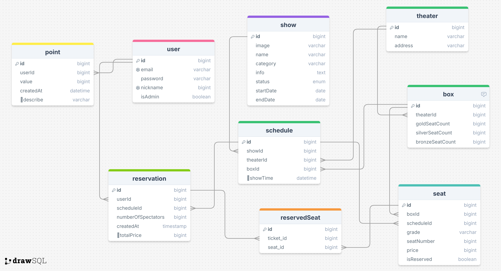

## 📝 ERD



## 📁 Project Structure

```shell
📦src
 ┣ 📂auth
 ┃ ┣ 📂dto
 ┃ ┃ ┣ 📜authSignIn.dto.ts
 ┃ ┃ ┗ 📜authSignUp.dto.ts
 ┃ ┣ 📜auth.controller.spec.ts
 ┃ ┣ 📜auth.controller.ts
 ┃ ┣ 📜auth.module.ts
 ┃ ┣ 📜auth.service.spec.ts
 ┃ ┣ 📜auth.service.ts
 ┃ ┣ 📜jwt.strategy.ts
 ┃ ┗ 📜roles.decorator.ts
 ┣ 📂box
 ┃ ┣ 📜box.entity.ts
 ┃ ┗ 📜boxGrade.type.ts
 ┣ 📂guards
 ┃ ┗ 📂roles
 ┃ ┃ ┣ 📜roles.guard.spec.ts
 ┃ ┃ ┗ 📜roles.guard.ts
 ┣ 📂point
 ┃ ┣ 📂dto
 ┃ ┃ ┣ 📜create-point.dto.ts
 ┃ ┃ ┗ 📜update-point.dto.ts
 ┃ ┗ 📂entities
 ┃ ┃ ┗ 📜point.entity.ts
 ┣ 📂reservation
 ┃ ┣ 📂dto
 ┃ ┃ ┣ 📜create-reservation.dto.ts
 ┃ ┃ ┗ 📜createSelectSeat-reservation.dto.ts
 ┃ ┣ 📂entities
 ┃ ┃ ┗ 📜reservation.entity.ts
 ┃ ┣ 📜reservation.controller.spec.ts
 ┃ ┣ 📜reservation.controller.ts
 ┃ ┣ 📜reservation.module.ts
 ┃ ┣ 📜reservation.service.spec.ts
 ┃ ┗ 📜reservation.service.ts
 ┣ 📂reservedSeat
 ┃ ┗ 📜reservedSeat.entity.ts
 ┣ 📂schedule
 ┃ ┣ 📂dto
 ┃ ┃ ┗ 📜create-schedule.dto.ts
 ┃ ┣ 📂entities
 ┃ ┃ ┗ 📜schedule.entity.ts
 ┃ ┣ 📜schedule.controller.spec.ts
 ┃ ┣ 📜schedule.controller.ts
 ┃ ┣ 📜schedule.module.ts
 ┃ ┣ 📜schedule.service.spec.ts
 ┃ ┗ 📜schedule.service.ts
 ┣ 📂seat
 ┃ ┣ 📜seat.entity.ts
 ┃ ┗ 📜seatGrade.type.ts
 ┣ 📂show
 ┃ ┣ 📂dto
 ┃ ┃ ┗ 📜create-show.dto.ts
 ┃ ┣ 📂entities
 ┃ ┃ ┗ 📜show.entity.ts
 ┃ ┣ 📂type
 ┃ ┃ ┗ 📜showStatus.type.ts
 ┃ ┣ 📜show.controller.spec.ts
 ┃ ┣ 📜show.controller.ts
 ┃ ┣ 📜show.module.ts
 ┃ ┣ 📜show.service.spec.ts
 ┃ ┗ 📜show.service.ts
 ┣ 📂theater
 ┃ ┗ 📜theater.entity.ts
 ┣ 📂user
 ┃ ┣ 📂entities
 ┃ ┃ ┗ 📜user.entity.ts
 ┃ ┣ 📂types
 ┃ ┃ ┗ 📜userRole.type.ts
 ┃ ┣ 📜user.controller.spec.ts
 ┃ ┣ 📜user.controller.ts
 ┃ ┣ 📜user.module.ts
 ┃ ┣ 📜user.service.spec.ts
 ┃ ┗ 📜user.service.ts
 ┣ 📂utils
 ┃ ┣ 📜match.decorator.ts
 ┃ ┗ 📜userinfo.decorator.ts
 ┣ 📜app.controller.spec.ts
 ┣ 📜app.controller.ts
 ┣ 📜app.module.ts
 ┣ 📜app.service.ts
 ┗ 📜main.ts
```
<br/>

## 개발 중 소개하고싶은 사항 (트러블 슈팅이라고 소개하고싶지만 그정도는 아닌)
```JS
@Get()
  findShow(
    @Query('category') category: string,
    @Query('name') name: string,
  ) {
    if (category) {
      return this.showService.findByCategory(category);
    } else if (name) {
      return this.showService.findByName(name);
    } else
      return this.showService.findAll();
  }
```
처음에 이 부분을 @Get(category), @Get(name) 이렇게 나눴는데
튜터님이 보시고 URI는 리소스를 나타내는건데 카테고리와 이름은 리소스라기 보단 분류 기준이라서 RESTful하지 못하다 라는 피드백을 주셔서
그냥 쿼리를 통해 검색할 수 있게 변경했습니다.

```JS
try {
      const selectedSeats  = [];

      for (let i = 0; i < createSelectSeatReservationDto.numberOfSpectators; i++) {
        const seat = await queryRunner.manager.findOne(Seat, {
          relations: {
            schedule: true,
          },
          where: {
            schedule: { id: schedule.id },
            id: createSelectSeatReservationDto.seatId[i],
            isReserved: false,
          },
          lock: {
            mode: 'pessimistic_write',
          },
        });

        if (!seat) {
          throw new NotFoundException('해당 좌석은 이미 예매된 좌석입니다. 다른 좌석을 예매 해주세요');
        }

        totalPrice += seat.price;
        selectedSeats.push(seat); // 좌석을 배열에 저장
      }

      const ownPointResult = await this.pointRepository
        .createQueryBuilder('point')
        .select('SUM(point.value)', 'point')
        .where('point.user.id = :userId', { userId: user.id })
        .getRawOne();

      const ownPoint = ownPointResult ? Number(ownPointResult.point) : 0;

      if (ownPoint < totalPrice) {
        throw new ConflictException('포인트가 부족합니다.');
      }

      const reservation = await queryRunner.manager.save(Reservation, {
        user: user,
        schedule: schedule,
        numberOfSpectators: createSelectSeatReservationDto.numberOfSpectators,
        totalPrice: totalPrice,
      });

      for (const seat of selectedSeats) {
        seat.isReserved = true;
        await queryRunner.manager.save(Seat, seat);
        await queryRunner.manager.save(ReservedSeat, {
          reservation: reservation,
          seat: seat,
        });
      }

      await queryRunner.manager.save(Point, {
        user: user,
        value: -reservation.totalPrice,
        description: `${schedule.show.name} 예매`,
      });

      await queryRunner.commitTransaction();
```
지금 코드 구조가 좌석을 조회해서 totalPrice를 계산하고 그 다음에 예약(reservation)을 만들고
그 다음에 좌석의 예매 여부를 true값 으로 바꿔서 하는 구조인데 처음에는 좌석 findOne()를 2번 사용했는데
이걸 selectedSeat 배열을 만들어서 findOne()을 2번 사용하는 코드를 수정했습니다.

그리고 예매 가능한 좌석을 조회하는 api를 만들어야하는데 까먹었습니다.
